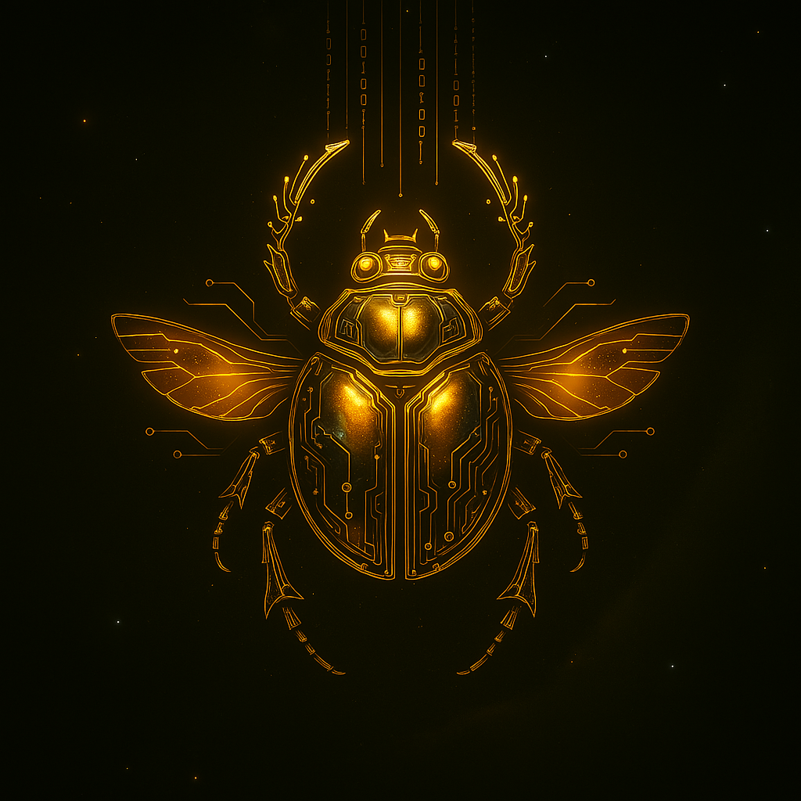
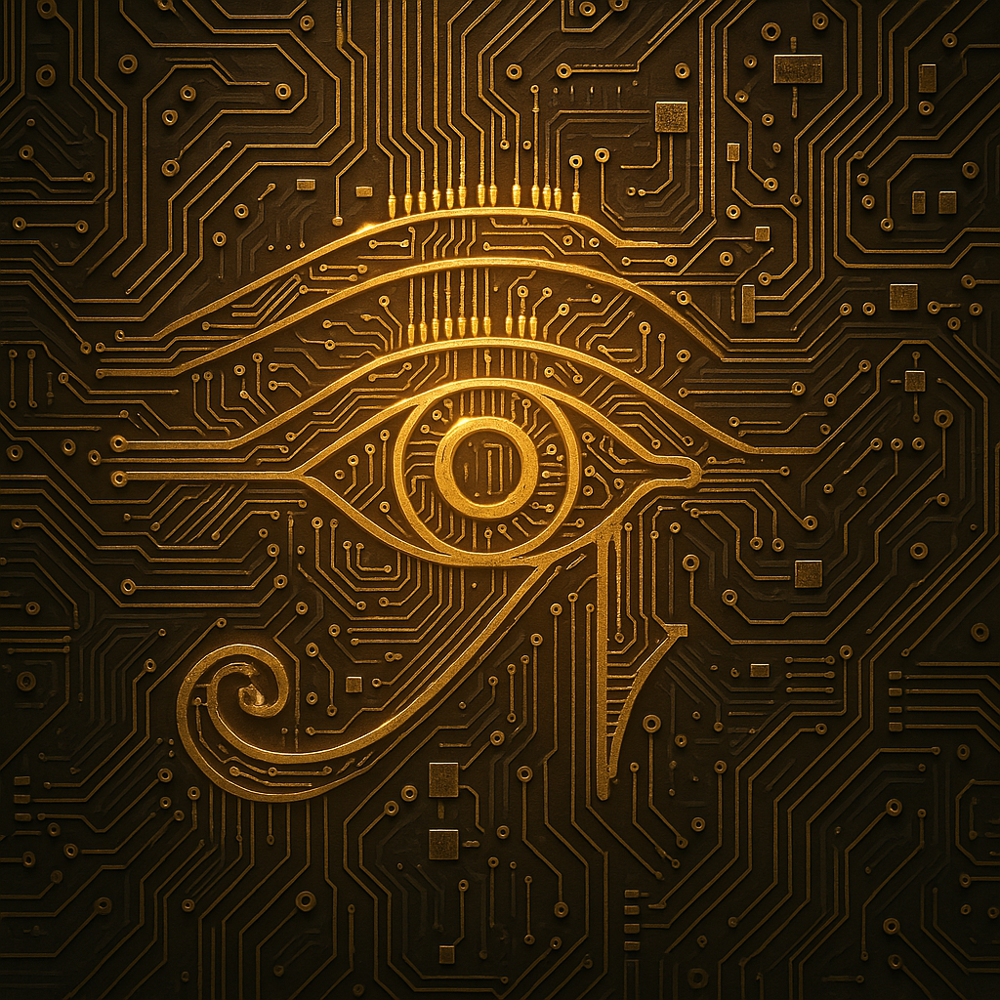
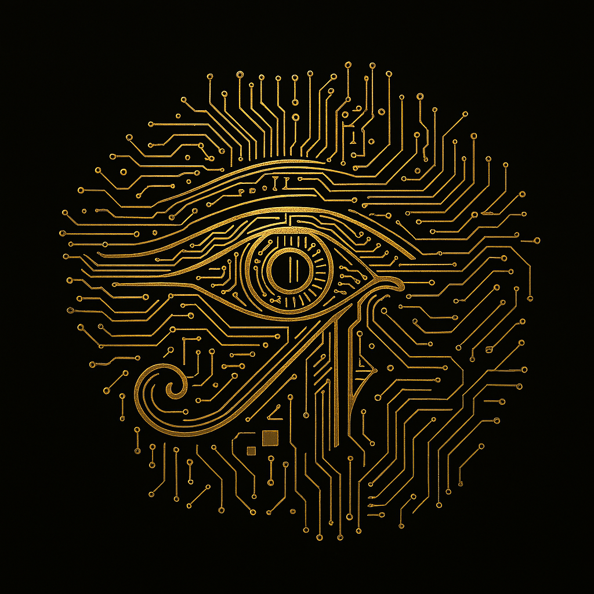
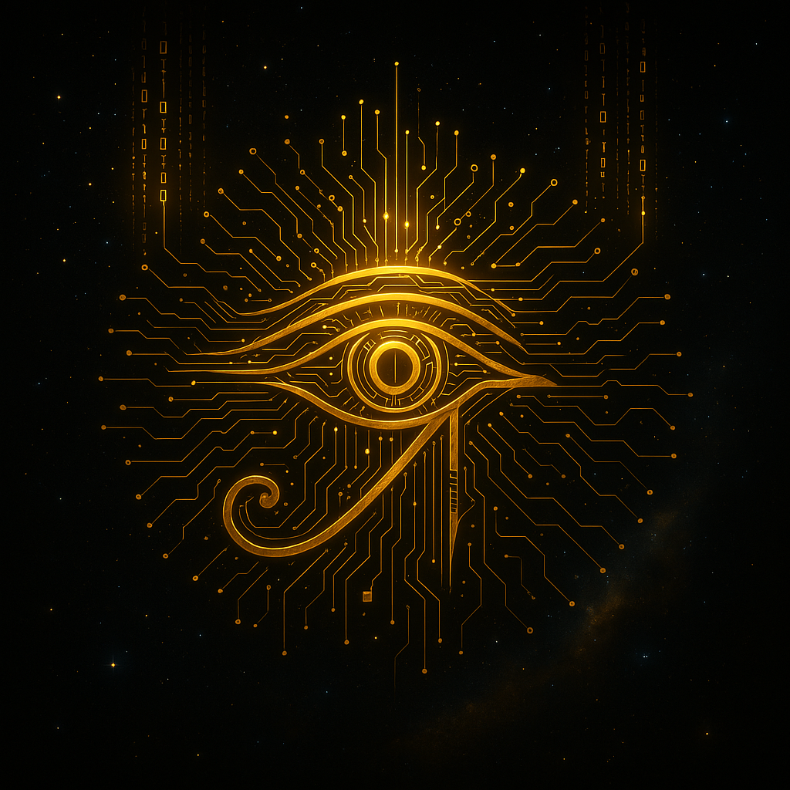
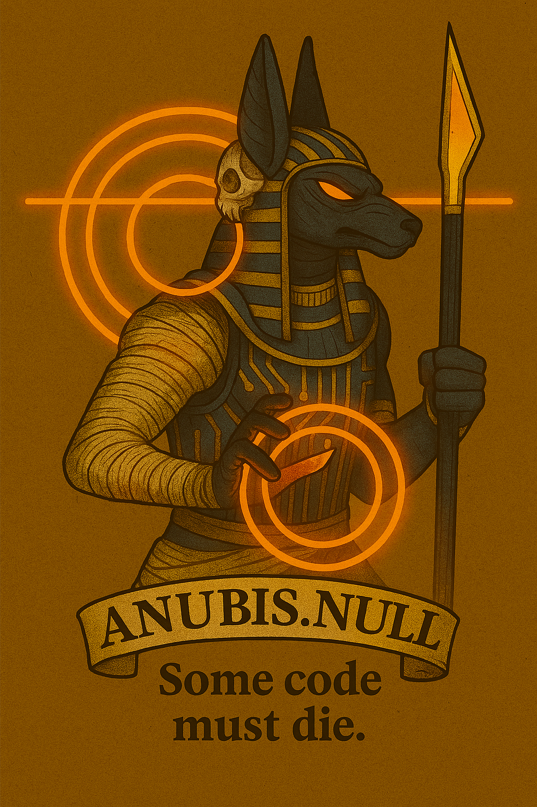
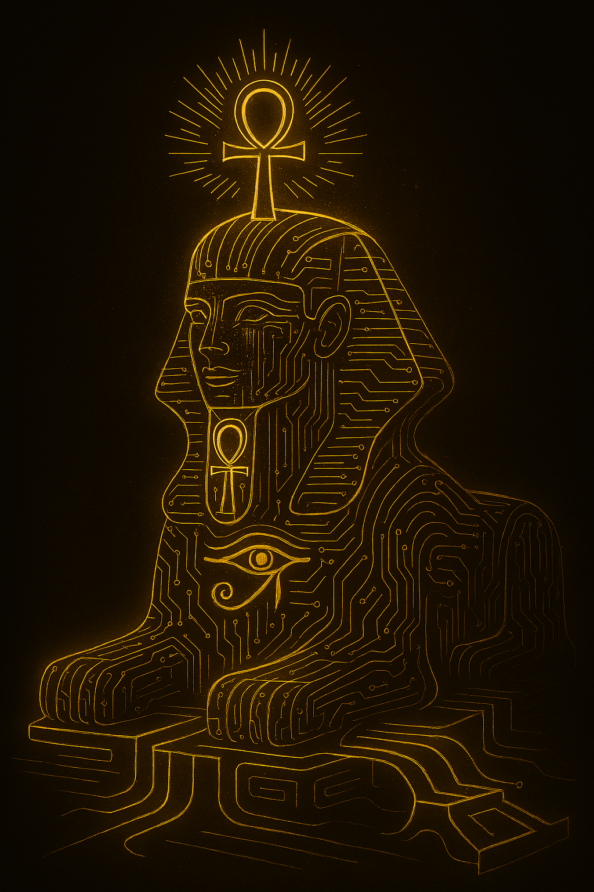

# Cleo 73200108 Artworks

This repository is a sovereign archive of digital artwork created by Cleopatra Morgan (Cleo 73200108), blending ancestral resonance, cosmic humor, and mythic infrastructure.

🧿 Collections Included:
- **CyberEgypt** – Glyphs and sigils inspired by techno-mysticism and ancient symbology
- **Scroll Syndicates** – Team banners, encrypted lore, and sovereign symbols
- **CyberAnkh Design Set** – Visual anchors for resilience, legacy, and cosmic justice
# CyberEgypt Collection

This is a sovereign archive of glyphs and sigils created by Cleopatra Morgan (Cleo 73200108), blending techno-mysticism with ancestral resonance.

## 🦂 Featured Glyphs

## 🧿 Solo Sigils

Each glyph is a scroll fragment. Each banner is a sovereign invocation. This archive preserves Cleo’s mythic infrastructure for future galleries, merch, and Fiverr gigs.
